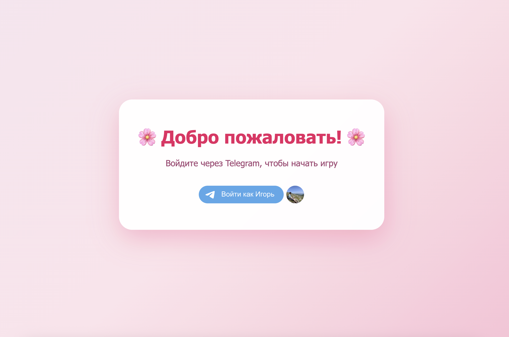
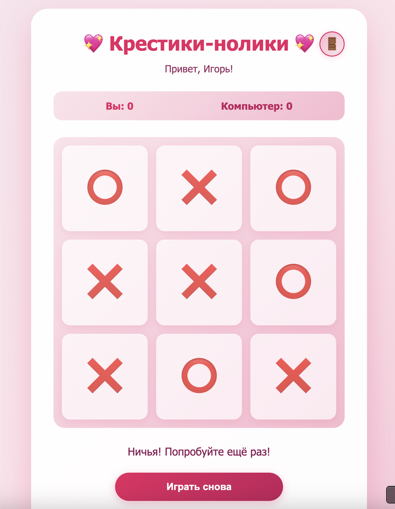
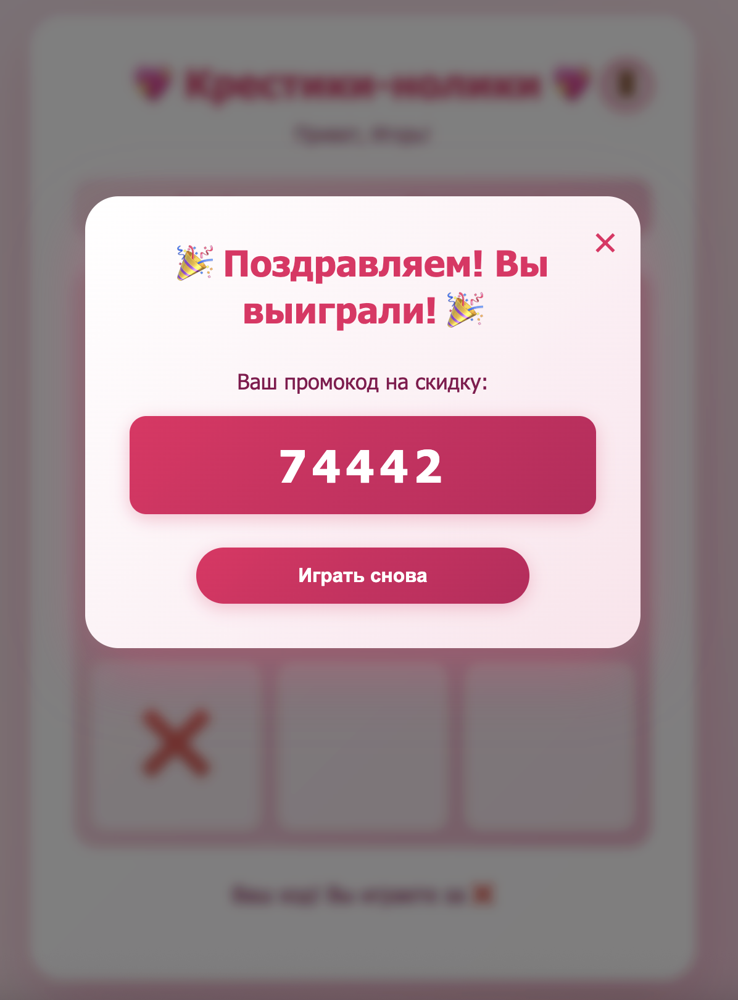
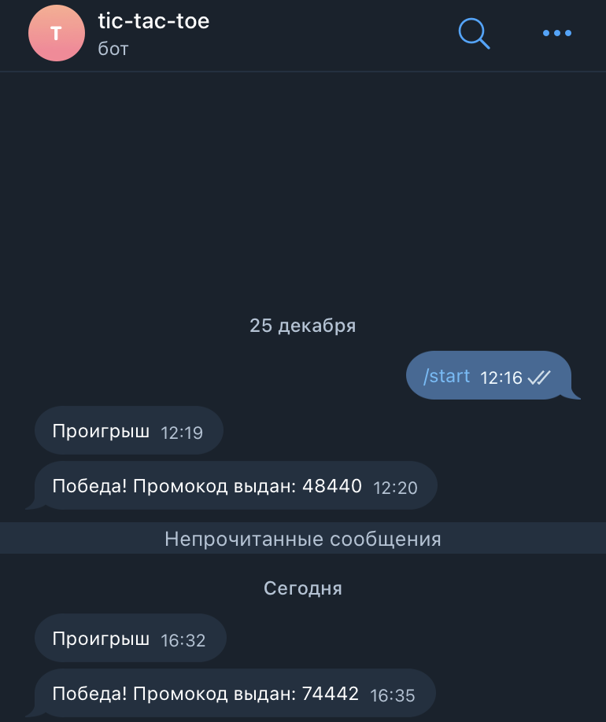

# Игра "Крестики-нолики" с авторизацией через Telegram и системой промокодов.

## Архитектура

Проект использует:
- **MVC паттерн** (Controllers, Models, Views)
- **Service Layer** для бизнес-логики
- **Repository Pattern** для работы с данными
- **Dependency Injection** через конструкторы
- **RESTful API** для взаимодействия frontend и backend

## Особенности безопасности

✅ **Валидация на сервере** - вся логика игры выполняется на бэкенде
✅ **Проверка авторизации** - каждый запрос проверяет наличие авторизованного пользователя
✅ **Валидация подписи Telegram** - проверка hash для предотвращения подделки данных
✅ **Валидация входных данных** - проверка позиций, типов данных
✅ **Сессии** - состояние игры хранится на сервере

## Требования

- PHP 7.4 или выше
- Веб-сервер (Apache/Nginx) с поддержкой mod_rewrite
- Telegram Bot Token
- Доступ к интернету для работы с Telegram API
- Расширение PHP: curl, json, session

## Установка

1. **Создайте Telegram бота:**
   - Откройте [@BotFather](https://t.me/BotFather) в Telegram
   - Отправьте команду `/newbot` и следуйте инструкциям
   - Сохраните полученный токен бота
   - Настройте домен для авторизации через Telegram Widget:
     - Отправьте `/setdomain` боту
     - Выберите вашего бота
     - Укажите домен, на котором будет размещено приложение (например: `yourdomain.com`)

2. **Настройте конфигурацию:**
   - Откройте файл `config/config.php`
   - Замените `YOUR_BOT_TOKEN_HERE` на токен вашего бота
   - Замените `YOUR_BOT_USERNAME` на username вашего бота (без @)
   - Или используйте переменные окружения .env

3. **Настройте веб-сервер:**

   **Apache:**
   - Убедитесь, что mod_rewrite включен
   - Настройте DocumentRoot на папку `public/`
   - Файл `.htaccess` уже настроен

   **Nginx:**
   ```nginx
   server {
       listen 80;
       server_name yourdomain.com;
       root /path/to/project/public;
       index index.php;

       location / {
           try_files $uri $uri/ /index.php?$query_string;
       }

       location ~ \.php$ {
           fastcgi_pass unix:/var/run/php/php7.4-fpm.sock;
           fastcgi_index index.php;
           include fastcgi_params;
           fastcgi_param SCRIPT_FILENAME $document_root$fastcgi_script_name;
       }
   }
   ```

4. **Права доступа:**
   ```bash
   chmod -R 755 /path/to/project
   chmod -R 777 /path/to/project/storage  # если будет использоваться файловое хранилище
   ```

## API Endpoints

### Авторизация

- `POST /api/auth/login` - Авторизация через Telegram
  ```json
  {
    "id": 123456789,
    "first_name": "Имя",
    "username": "username",
    "auth_date": 1234567890,
    "hash": "hash_string"
  }
  ```

- `GET /api/auth/check` - Проверка авторизации
- `POST /api/auth/logout` - Выход

### Игра

- `GET /api/game/state` - Получить текущее состояние игры
- `POST /api/game/move` - Сделать ход
  ```json
  {
    "position": 0
  }
  ```
- `POST /api/game/reset` - Сбросить игру

## Как это работает

1. **Авторизация:**
   - Пользователь открывает страницу
   - Если не авторизован, видит кнопку входа через Telegram Widget
   - После авторизации данные валидируются на сервере и сохраняются в сессии

<br>
  <div align="center">
   
  </div>
<br><br>


2. **Игра:**
   - Frontend отправляет запрос на `/api/game/move` с позицией
   - Backend валидирует запрос, проверяет авторизацию
   - GameService обрабатывает ход игрока
   - AI делает ответный ход (вся логика на сервере)
   - Состояние игры сохраняется в сессии
   - Frontend получает обновленное состояние и отображает его

<br>
  <div align="center">
   
  </div>
<br><br>

3. **Результаты:**
   - При победе игрока:
     - PromoCodeService генерирует промокод на сервере
     - TelegramService отправляет сообщение в Telegram
     - Frontend получает промокод и отображает его
   - При проигрыше:
     - TelegramService отправляет уведомление
     - Frontend показывает модальное окно


<br>
  <div align="center">
   
   
  </div>
<br><br>

## Разработка

Для разработки можно использовать встроенный PHP сервер:

```bash
cd public
php -S localhost:8000
```

Затем откройте `http://localhost:8000` в браузере.